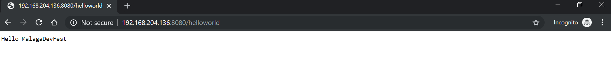

# Quarkus-Kotlin
<br/>
<p align="center">

<br/>
</p>
<br/>

## Create a Kotlin project with Quarkus Maven Plugin.
> In this case, we already generate the Kotlin project using the maven plugin through this command: ``` mvn io.quarkus:quarkus-maven-plugin:1.0.1.Final:create \
    -DprojectGroupId=org.malagadevfest \
    -DprojectArtifactId=quarkus-kotlin \
    -DclassName="org.malagadevfest.quarkus.HelloWorld" \
    -Dpath="/helloworld" \
    -Dextensions="kotlin,resteasy-jsonb" ```

## JVM Mode

```
mvn package
```
```
docker build -f src/main/docker/Dockerfile.jvm -t quarkus/quarkus-kotlin-jvm .
```
```
docker run -i --rm -p 8080:8080 quarkus/quarkus-kotlin-jvm
```

## Native Mode

```
mvn package -Pnative -Dquarkus.native.container-build=true
```
```
docker build -f src/main/docker/Dockerfile.native -t quarkus/quarkus-kotlin .
```
```
docker run -i --rm -p 8080:8080 quarkus/quarkus-kotlin
```

## Check that the application is running
<br/>
<p align="center">

<br/>
</p>
<br/>
